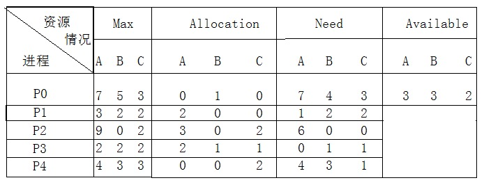
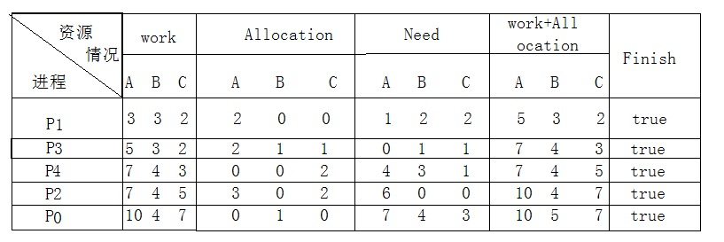

# java concurrent

> 分工，同步，互斥


## 死锁：

> 参考来源：[source](https://blog.csdn.net/hj605635529/article/details/69214903)

我们先来思考一个问题：我们加锁以后，再次进行加锁，这样会发生什么？

当我们第二次申请锁的时候，这个时候锁已经被占用了，该线程就会被挂起，但是刚好这个线程就是拥有锁的线程了，那么这个线程就永远挂起等待了，这个我们就叫死锁。

### 1.死锁发生的情形：

（1）一个线程两次申请锁。

（2）两个线程互相申请对方的锁，但是对方都不释放锁。

### 2.死锁产生的必要条件：

（1） 互斥：一次只有一个线程可以使用一个资源。其他线程不能访问已分配给其他线程的资源。

（2）占有且等待：当一个线程在等待分配得到其他资源时，其继续占有已分配得到的资源。

（3）不可抢占：不能强行抢占其它线程中已占有的资源。

（4）循环等待：存在一个封闭的线程链，使得每个资源至少占有此链中下一个线程所需要的一个资源。

### 3.处理死锁的四种方法：

（1）死锁预防：通过确保死锁的一个必要条件不会满足，保证不会发生死锁

（2）死锁检测：允许死锁的发生，但是可以通过系统设置的检测结构及时的检测出死锁的发生，采取一些措施，将死锁清除掉

（3）死锁避免：在资源分配过程中，使用某种方法避免系统进入不安全的状态，从而避免发生死锁

（4）死锁解除：与死锁检测相配套的一种措施。当检测到系统中已发生死锁，需将进程从死锁状态中解脱出来。

常用方法：撤销或挂起一些进程，以便回收一些资源，再将这些资源分配给已处于阻塞状态的进程。

### 4.处理死锁的具体细节：

#### 一、死锁预防：破坏死锁的四个条件中的一个或几个

(1)互斥：它是设备的固有属性所决定的，不仅不能改变，还应该加以保证。
(2)占有且等待：为预防占有且等待条件，可以要求进程一次性的请求所有需要的资源，并且阻塞这个进程直到所有请求都同时满足。这个方法比较低效。
(3)不可抢占：预防这个条件的方法：
\*如果占有某些资源的一个进程进行进一步资源请求时被拒绝，则该进程必须释放它最初占有的资源。
\*如果一个进程请求当前被另一个进程占有的一个资源，则操作系统可以抢占另外一个进程，要求它释放资源。
(4)循环等待：通过定义资源类型的线性顺序来预防。
\*如果一个进程已经分配了R类资源，那么接下来请求的资源只能是那些排在R类型之后的资源类型。该方法比较低效。

#### 二、死锁避免：

##### 两种死锁避免算法：

\*进程启动拒绝：如果一个进程的请求会导致死锁，则不启动该进程。
\*资源分配拒绝：如果一个进程增加的资源请求会导致死锁，则不允许此分配(银行家算法)。

银行家算法：
1.如果request<=need，转向步骤2；否则认为出错，因为请求资源大于需要资源。
2.如果request<=available，转向步骤3,；否则尚无足够资源，进程p阻塞；
3.系统尝试为把资源分配给进程P，并修改available、allocation和need的数值。
4.系统执行安全性算法，检查此次分配后系统是否处于安全状态，若安全，才正式将资源分配给进程P，否则将本次试探性分配作废，让进程P等待。
\*安全状态：系统能按照某种进程顺序，为每个进程分配资源，直至满足每个进程对资源的最大需求，使每个进程都可顺利完成。

#### 三、死锁检测

一个简单的死锁检测算法：
每个进程、每个资源制定唯一编号      设定一张资源分配表，记录各进程与占用资源之间的关系      设置一张进程等待表，记录各进程与要申请资源之间的关系

*   　资源分配表

| 资源 | 进程 |
| --- | --- |
| r1 | p2 |
| r2 | p5 |
| r3 | p4 |
| r4 | p1 |
| .. | .. |

　进程等待表

| 资源 | 进程 |
| --- | --- |
| p1 | r1 |
| p2 | r3 |
| p4 | r4 |
| .. | ..

 |

分析：
p1\-r1\-p2\-r3\-p4\-r4\-p1 出现环路引起死锁

#### （四）、死锁的解除：

\*两种常用的死锁解除方法：

1) 资源剥夺法。挂起某些死锁进程，并抢占它的资源，将这些资源分配给其他的死锁进程。但应防止被挂起的进程长时间得不到资源，而处于资源匮乏的状态。
2) 撤销进程法。强制撤销部分、甚至全部死锁进程并剥夺这些进程的资源。撤销的原则可以按进程优先级和撤销进程代价的高低进行。

##### 银行家算法：

> 参考来源：[source](https://blog.csdn.net/L_XRUI/article/details/72935173)

每一个线程进入系统时，它必须声明在运行过程中，所需的每种资源类型最大数目，其数目不应超过系统所拥有每种资源总量，当线程请求一组资源系统必须确定有足够资源分配给该进程，若有在进一步计算这些资源分配给进程后，是否会使系统处于不安全状态，不会（即若能在分配资源时找到一个安全序列），则将资源分配给它，否则等待。

具体介绍：

假定系统中有五个线程{P0，P1，P2，P3，P4}和三类资源{A,B,C},各类资源数量分别为10,5,7,在T0时刻分配资源情况如图：

Max:表示线程对每类资源的最大需求量；

Allocation:表示系统给线程已分配每类资源的数目；

Need:表示线程还需各类资源数目；

Available:表示系统当前剩下的资源。



从初始找出安全序列：

(1)首先系统剩下资源{3,3,2}，查表可满足5个进程Need的进程有：P1(1,2,2)、P3(0,1,1),先给P1分配；

(2)P1分配以后执行完释放其所占资源后系统此时剩下资源有：Allocation+{3,3,2}={5,3,2};

(3)根据系统剩下资源查表可满足剩下4个进程Need的进程有P3{0,1,1}、P4{4,3,1}，再给P3分配；

(4)P3分配以后执行完释放其所占资源后系统此时剩下资源有：Allocation+{5,3,2}={7,4,3};

(5)根据系统剩下资源查表可满足剩下3个进程Need的进程有P0{7,4,3}、P2{6,0,0}、P4{4,3,1},再给P4分配；

(6)P4分配以后执行完释放其所占资源后系统此时剩下资源有：Allocation+{7,4,3}={7,4,5};

(7)根据系统剩下资源查表可满足剩下2个进程Need的进程有P0{7,4,3}、P2{6,0,0},再给P2分配;

(8)P2分配以后执行完释放其所占资源后系统此时剩下资源有：Allocation+{7,4,5}={10,4,7};

(9)根据系统剩下资源查表可满足剩下1个进程Need的进程有P0{7,4,3},最后给P0分配;

(10)P0 分配以后执行完释放其所占资源后系统此时剩下资源有：Allocation+{10,4,7}={10,5,7};

(11)所有进程按此序列{P1,P3,P4,P2,P0}可安全执行完毕，最后系统资源全部释放。（由以上也可知安全序列不唯一，但只要找出一个安全序列，说明此系统是安全的（找到安全序列可按此序列真正执行进程推进顺序，若没找到，则恢复初始状态，其并没有真正给进程分配资源，只是提前避免））

由表表示：

work:表示系统当前剩下的资源数；

 
 
 ### java 管程
 
 >Hasen 模型, Hoare 模型, MESA 模型
 
 - 互斥 同一时刻只允许一个线程访问资源
 - 同步 线程间的通信，协作
 
 #### synchronized 的三种使用方法
 
 - 修饰实例方法，作用于当前实例加锁，进入同步代码前要获得当前实例的锁
 
 - 修饰静态方法，作用于当前类对象加锁，进入同步代码前要获得当前类对象的锁
 
 - 修饰代码块，指定加锁对象，对给定对象加锁，进入同步代码库前要获得给定对象的锁。

####  synchronized 修饰代码块

 ```text

 monitorenter  //进入同步方法
//..........省略其他  
monitorexit   //退出同步方法
 goto          24
//省略其他.......
 monitorexit //退出同步方法

```

#### synchronized 修饰方法

```text

ACC_SYNCHRONIZED

```
 ACC_SYNCHRONIZED 修饰方法
 
 #### JVM对 synchronized 的优化
 
 - *偏向锁*
 
 偏向锁是Java 6之后加入的新锁，它是一种针对加锁操作的优化手段，经过研究发现，在大多数情况下，锁不仅不存在多线程竞争，而且总是由同一线程多次获得，因此为了减少同一线程获取锁(会涉及到一些CAS操作,耗时)的代价而引入偏向锁。偏向锁的核心思想是，如果一个线程获得了锁，那么锁就进入偏向模式，此时Mark Word 的结构也变为偏向锁结构，当这个线程再次请求锁时，无需再做任何同步操作，即获取锁的过程，这样就省去了大量有关锁申请的操作，从而也就提供程序的性能。所以，对于没有锁竞争的场合，偏向锁有很好的优化效果，毕竟极有可能连续多次是同一个线程申请相同的锁。但是对于锁竞争比较激烈的场合，偏向锁就失效了，因为这样场合极有可能每次申请锁的线程都是不相同的，因此这种场合下不应该使用偏向锁，否则会得不偿失，需要注意的是，偏向锁失败后，并不会立即膨胀为重量级锁，而是先升级为轻量级锁。下面我们接着了解轻量级锁。
 
 - *轻量级锁*
 
 倘若偏向锁失败，虚拟机并不会立即升级为重量级锁，它还会尝试使用一种称为轻量级锁的优化手段(1.6之后加入的)，此时Mark Word 的结构也变为轻量级锁的结构。轻量级锁能够提升程序性能的依据是“对绝大部分的锁，在整个同步周期内都不存在竞争”，注意这是经验数据。需要了解的是，轻量级锁所适应的场景是线程交替执行同步块的场合，如果存在同一时间访问同一锁的场合，就会导致轻量级锁膨胀为重量级锁。
 
 - *自旋锁*
 
 轻量级锁失败后，虚拟机为了避免线程真实地在操作系统层面挂起，还会进行一项称为自旋锁的优化手段。这是基于在大多数情况下，线程持有锁的时间都不会太长，如果直接挂起操作系统层面的线程可能会得不偿失，毕竟操作系统实现线程之间的切换时需要从用户态转换到核心态，这个状态之间的转换需要相对比较长的时间，时间成本相对较高，因此自旋锁会假设在不久将来，当前的线程可以获得锁，因此虚拟机会让当前想要获取锁的线程做几个空循环(这也是称为自旋的原因)，一般不会太久，可能是50个循环或100循环，在经过若干次循环后，如果得到锁，就顺利进入临界区。如果还不能获得锁，那就会将线程在操作系统层面挂起，这就是自旋锁的优化方式，这种方式确实也是可以提升效率的。最后没办法也就只能升级为重量级锁了。
 
 - *锁消除*
 
 消除锁是虚拟机另外一种锁的优化，这种优化更彻底，Java虚拟机在JIT编译时(可以简单理解为当某段代码即将第一次被执行时进行编译，又称即时编译)，通过对运行上下文的扫描，去除不可能存在共享资源竞争的锁，通过这种方式消除没有必要的锁，可以节省毫无意义的请求锁时间，如下StringBuffer的append是一个同步方法，但是在add方法中的StringBuffer属于一个局部变量，并且不会被其他线程所使用，因此StringBuffer不可能存在共享资源竞争的情景，JVM会自动将其锁消除。
